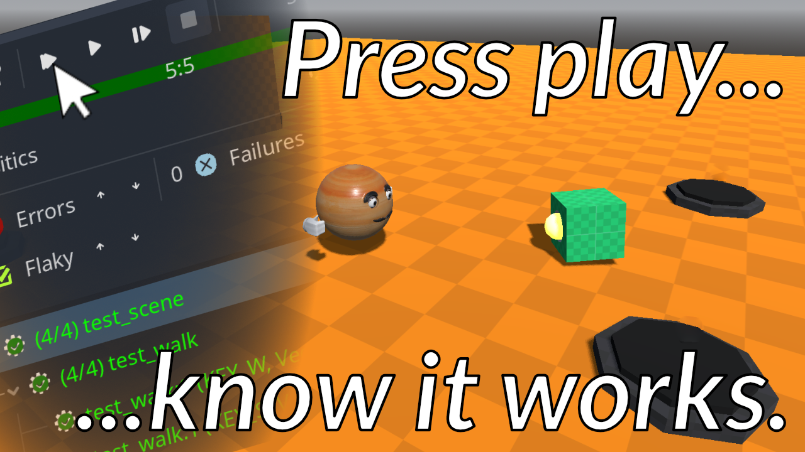

# Automated testing in Godot

   

Hello, Godotneers! Thank you very much for watching this video. This repository contains the example project, that we used in the video. You can use it to follow along with the video or to experiment on your own.

## Using this repository
There is a `start` branch that contains the code as it was at the beginning of the video. You can use this branch to follow along with the video if you'd like.

The `main` branch contains the code as it was at the end of the video. If you don't know how to use git, you can also download the code as a zip file using these links:

- [Download the code as a zip file (at the end of the video)](https://github.com/godotneers/testing-video/archive/refs/heads/main.zip)
- [Download the code as a zip file (at the beginning of the video)](https://github.com/godotneers/testing-video/archive/refs/heads/start.zip)

## Support me

If this video and the example code were helpful to you, please consider supporting me on [Ko-fi](https://ko-fi.com/derkork). Thank you very much!

## License

The code in this repository are licensed under the MIT license. See the LICENSE file for more information. All the image assets used in this repository (except the `addons` folder) are licensed under CC-BY-SA 4.0 (see http://creativecommons.org/licenses/by-sa/4.0/). Addons in the `addons` folder have their own licensing, please check the respective addon website for details.
